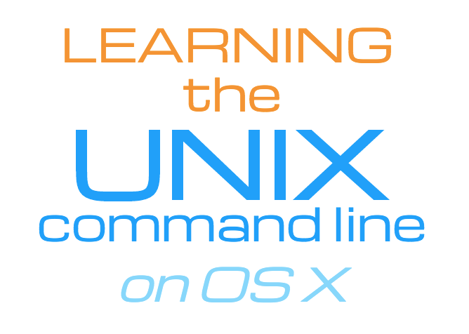

Welcome to Learning the UNIX Command Line.  My name is Chip Castle and I'll be
your instructor.

OS X
----
This course is intended for newcomers to the UNIX operating system which comes
installed on all modern Apple computers.  To be accurate, that system is called
OS ten, but because so many people refer to it as OS X, that is most likely
what you'll hear me say throughout the course.

Goal
----
The goal of this course is to provide an introduction to basic UNIX commands
and concepts.  At the end, students should posses the skills necessary to get
around the system, as well as the ability to learn more about the system on
their own. 

Outline
-------
So here's a brief outline of the course topics:

Why should I learn the UNIX command line?
-----------------------------------------
To start off we'll cover some of the benefits of learning the UNIX command line,
as well as a brief overview of UNIX history and philosophy and why it's
important.

Configuring the Terminal
------------------------
Since we'll be using the default Terminal application that comes shipped with
the Mac, it be will useful to understand how to configure it to suit our needs,
especially in terms of its overall look-and-feel.

Getting Help
------------
In the Getting Help section, I'll demonstrate how to access the system manual
so that you can get more information about the commands we'll be discussing,
and how to get the most out of those commands.

Managing files and directories
------------------------------
You'll learn how to navigate the directory structure, manipulate files and have
a general grasp of how they are organized on the system.

Understanding directory & file permissions
------------------------------------------
I'll cover what file and directory permissions are, a couple of common ways
those permissions can be modified, as well as user and group ownership.

Redirection and Pipes
---------------------
I'll cover Redirection and Pipes, which in my view is one of the most
fundamental features of the UNIX operating system, and see how using filters is
can be so powerful. 

Working with Processes
----------------------
You'll learn how to view processes on your system, the difference between
'background' and 'foreground' processes, as well as how to communicate with
processes and stop them using UNIX signals.

Installing software from the command line
-----------------------------------------
To get the most out of any system you'll need to understand how to install and
remove software.  There are a variety of ways that this can be accomplished on the
Mac, and I'll cover the more common approaches.

Features of a UNIX shell 
------------------------
We'll also cover various features of a shell, such as using aliases to minimize
keystrokes, what ENVIRONMENT variables are, and how you can use shell
initialization files to set these variables.

So that's the overview.  Let's get started learning the UNIX command line!

